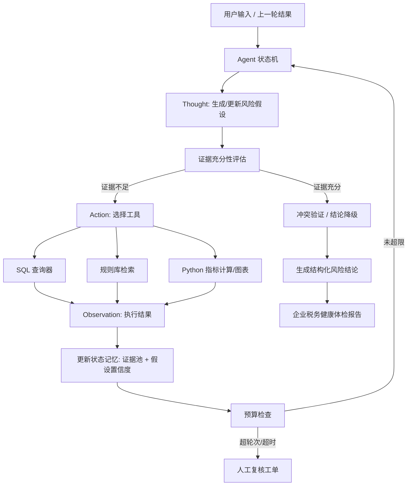

# 系统架构

## 目标

系统输入企业财务报表、发票流向、行业基准和税务规则，输出结构化风险结论、推理链和图文报告。设计重点不是让大模型直接“拍脑袋判断”，而是让 Agent 按税务稽查路径补证据、调工具、做交叉验证。

## Agent 编排

## 模块

- API 层：FastAPI 提供 `/api/v1/diagnostics/run`。
- Agent 层：`TaxRiskDiagnosticAgent` 实现状态机、证据池、预算检查、风险结论生成。
- 工具层：`SafeSqlTool` 限制只读查询，`MetricTool` 执行财务指标计算，`RuleRetrievalTool` 召回税务规则。
- 知识库层：Milvus 优先，内存规则库降级，保证演示可运行。
- 报告层：Markdown 报告和 matplotlib 指标图。

## 生产化要点

- 数据安全：SQL 工具只允许 SELECT，生产环境需增加租户隔离、字段脱敏和审计日志。
- 可观测性：记录每轮 Thought/Action/Observation，但对外报告只展示可解释推理链，不暴露内部敏感 prompt。
- 模型降级：Qwen 服务不可用时使用规则引擎兜底，避免批量诊断任务中断。
- 人工复核：证据不足、工具超限、结论冲突时自动输出人工复核建议。

