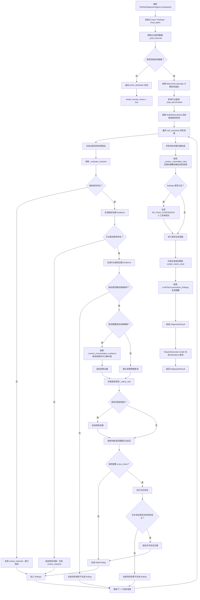

# diagnostic_agent.py 执行逻辑流程图

对应文件：

```text
app/tax_risk_agent/agent/diagnostic_agent.py
```

## Mermaid 流程图



## 简化理解

```text
run(request)
  ↓
读财务数据
  ↓
算指标
  ↓
查行业基准
  ↓
查规则库
  ↓
逐个风险场景评估
  ↓
证据充分：生成风险结论
证据不足：生成人工复核
  ↓
处理未覆盖规则
  ↓
生成摘要和报告
  ↓
返回诊断结果
```

## 核心设计

`diagnostic_agent.py` 不再只硬编码某几个风险，而是通过 `RiskScenario` 风险场景配置驱动诊断。

每个风险场景统一走：

```text
指标证据
  ↓
行业基准
  ↓
明细查询
  ↓
规则检索
  ↓
交叉验证
  ↓
结论 / 人工复核
```

