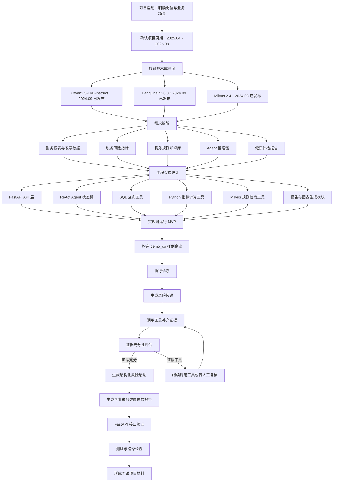
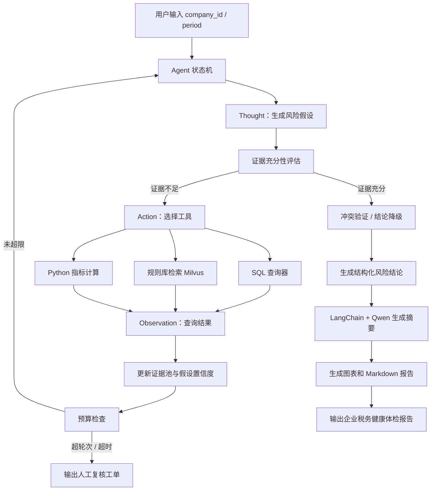

# 税务风险智能诊断分析系统：规划与实现过程

## 一、项目定位

这个项目的目标不是做一个简单的“上传财务数据，然后让大模型写报告”的应用，而是实现一个可审计、可解释、可落地的税务风险诊断 Agent。

核心思路是：把税务专家的稽查过程拆成可执行的 Agent 状态机，让大模型负责风险假设、推理解释和报告表达，让 SQL、Python 指标计算、规则库检索负责确定性证据获取。这样既能体现大模型应用能力，也能避免面试时被追问“大模型幻觉怎么控制”而没有工程答案。

## 二、技术选型判断

### 1. 主模型：Qwen2.5-14B-Instruct

Qwen2.5-14B-Instruct 在 2024 年 9 月发布，到项目周期 2025.04 - 2025.08 已经具备成熟使用条件。14B 规模在企业私有化部署中比较平衡：比 7B 更适合复杂中文业务推理，比 32B/72B 更容易控制推理成本。

在项目中它主要承担：

- 生成风险假设；
- 解释工具返回的证据；
- 组织自然语言推理链；
- 生成《企业税务健康体检报告》摘要和分析段落。

但它不直接负责最终数值计算，财务指标必须由 Python/SQL 工具完成。

### 2. 编排框架：LangChain

LangChain 用于统一模型调用、工具抽象和 Agent 编排。项目实现上没有把所有逻辑强绑定到 LangChain Agent Executor，而是采用“业务状态机 + LangChain 模型客户端”的方式。

这样设计的原因是：

- 税务诊断有明确业务状态，不适合完全交给自由 Agent 漫游；
- 状态机便于做预算控制、超时控制、人工复核分流；
- LangChain 保留在模型接入层，方便接入 Qwen2.5 OpenAI-compatible 服务。

### 3. 向量库：Milvus

Milvus 用于税务规则、稽查案例、风险口径说明等知识召回。项目中设计为 Milvus 优先，内存规则库兜底。

这样做的好处是：

- 面试和本地演示时不依赖完整 Milvus 服务；
- 生产部署时可以直接切换到 Milvus；
- 规则检索能力可以解释为 RAG 组件，而不是写死规则。

### 4. 数据层：SQLite 原型，生产可替换 PostgreSQL/MySQL

本地可运行版本使用 SQLite 承载样例财务报表、发票流水和行业基准。生产中可以替换为 PostgreSQL、MySQL 或企业数仓。

SQL 工具只允许 SELECT，禁止 DELETE、UPDATE、INSERT 等写操作，体现生产安全意识。

## 三、需求拆解

项目被拆成五类能力：

1. 数据接入能力：读取企业财务报表、发票流向、行业基准。
2. 指标计算能力：计算税负率、毛利率、差旅费率、咨询费率、人均差旅费等。
3. 规则检索能力：从税务规则库中召回相关稽查规则。
4. Agent 推理能力：生成风险假设、补充证据、判断证据充分性、处理冲突。
5. 报告生成能力：输出结构化风险结论、证据链、整改建议和图表。

## 四、Agent 编排设计

Agent 的执行过程被设计成类似税务稽查专家的工作流：

1. Thought：读取基础数据，生成初始风险假设。
2. Evidence Evaluation：判断当前证据是否足以形成结论。
3. Action：选择工具，例如 SQL 查询、规则库检索、Python 指标计算。
4. Observation：接收工具结果，写入证据池。
5. Memory Update：更新风险假设置信度。
6. Conflict Resolution：如果指标之间存在冲突，进行交叉验证。
7. Budget Check：检查最大轮次、工具次数、超时限制。
8. Conclusion：生成结构化风险结论。
9. Report：生成企业税务健康体检报告。
10. Human Review：证据不足或超预算时，转人工复核。

## 五、实现步骤

### 阶段一：工程骨架

先创建标准 Python 项目结构：

- `app/tax_risk_agent/api`：FastAPI 接口；
- `app/tax_risk_agent/agent`：Agent 状态机；
- `app/tax_risk_agent/tools`：SQL、指标计算、规则检索工具；
- `app/tax_risk_agent/vectorstore`：Milvus 与内存规则库；
- `app/tax_risk_agent/reports`：报告和图表生成；
- `scripts`：样例数据库初始化和 demo；
- `tests`：单元测试；
- `docs`：架构和实施计划文档。

### 阶段二：样例数据

构造三张核心表：

- `financial_statements`：收入、成本、已缴增值税、差旅费、咨询费、员工数；
- `invoices`：发票方向、交易对手、发票类别、金额、税额；
- `industry_benchmarks`：行业指标 P50、P75、P90。

样例企业 `demo_co` 被设计成存在两个风险：

- 差旅费率 8.17%，高于行业 P90 5.50%；
- 税负率 3.00%，低于行业 P50 3.80%，但毛利率并不低。

### 阶段三：工具层

实现三个核心工具：

- `SafeSqlTool`：只读 SQL 查询，防止 Agent 执行破坏性语句；
- `MetricTool`：确定性计算税负率、毛利率、费用率等指标；
- `RuleRetrievalTool`：从 Milvus 或内存规则库召回税务规则。

工具层的设计原则是：大模型不能直接编造证据，所有关键证据必须来自工具返回。

### 阶段四：Agent 状态机

实现 `TaxRiskDiagnosticAgent`：

- 读取企业财务数据；
- 调用 Python 指标计算；
- 查询行业基准；
- 检索税务规则；
- 针对差旅费异常进行发票对手方集中度查询；
- 针对税负率偏低进行毛利率交叉验证；
- 根据证据生成高/中/低风险结论；
- 证据不足时输出人工复核建议。

### 阶段五：报告生成

报告包含：

- 摘要；
- 风险等级；
- 风险结论；
- 证据链；
- 整改建议；
- Agent 推理链；
- 指标对比图表。

报告格式先使用 Markdown，便于面试演示和版本管理。生产环境可扩展为 PDF、Word 或前端报告页。

### 阶段六：API 与演示

提供 FastAPI 接口：

```text
POST /api/v1/diagnostics/run
```

请求参数：

```json
{
  "company_id": "demo_co",
  "period": "2025Q2"
}
```

返回结构化诊断结果，包括风险结论、推理链、报告路径和人工复核标记。

## 六、2025.04 - 2025.08 项目排期

| 时间 | 工作重点 | 交付结果 |
| --- | --- | --- |
| 2025.04 | 需求分析、税务风险场景拆解、数据表设计 | 指标口径、样例数据、项目架构 |
| 2025.05 | 税务规则库、Milvus 检索、RAG 原型 | 规则召回工具、知识库检索链路 |
| 2025.06 | ReAct Agent、SQL 工具、Python 指标计算 | 可运行 Agent MVP |
| 2025.07 | 报告生成、图表、推理链可视化 | 企业税务健康体检报告 |
| 2025.08 | API、测试、安全控制、演示部署 | 生产级工程骨架和验收版本 |

## 七、面试讲法

可以这样表达：

“我没有把项目做成简单的 LLM 问答，而是把税务专家的稽查思路拆成了 Agent 状态机。Agent 先生成风险假设，然后判断证据是否充分；如果证据不足，就自主选择 SQL 查询、规则库检索或 Python 指标计算工具。比如发现差旅费率过高时，Agent 会查询行业 P90，再查发票对手方集中度，最后结合税务规则生成高风险结论。Qwen2.5-14B-Instruct 主要负责推理解释和报告生成，关键数值和证据全部由工具返回，避免大模型幻觉。”

## 八、实现流程图



## 九、Agent 运行流程图


